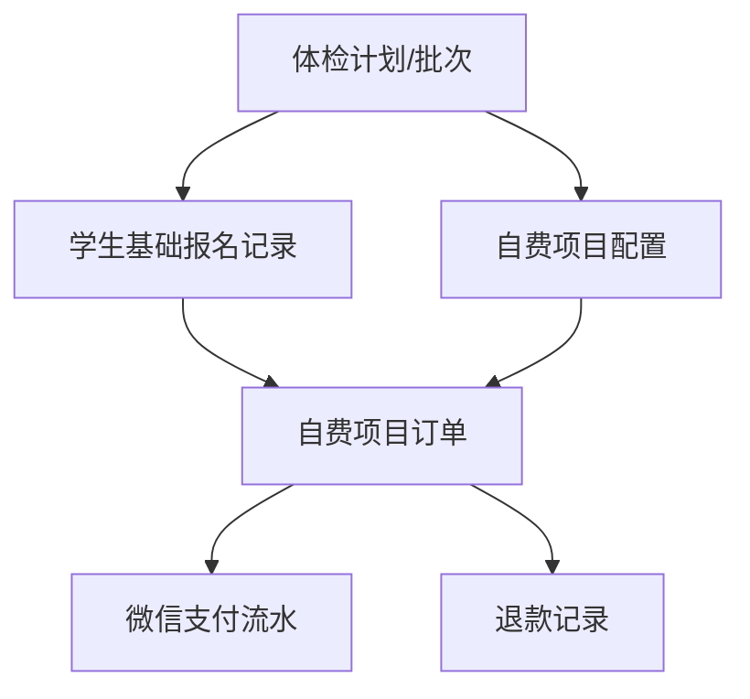

# 体检报名与自费项目收费退费说明

## 一、设计目标

体检报名页面需要同时支持基础体检报名和自费项目选择，但两类业务不应强绑定。

基础体检报名是家长确认学生参加本次学校或医院组织的免费筛查项目，自费项目是医院围绕本次体检计划提供的可选增值检查服务。家长完成基础报名后，可以在医院设置的截止时间前继续选择自费项目、生成订单并完成微信支付。

该设计既保证基础筛查报名不受自费项目选择影响，也支持医院开展自费项目收费、退款、重选和现场执行管理。

## 二、核心业务原则

### 1. 免费项目与自费项目分离处理

体检计划中的基础项目，如体重、视力、脊柱、口腔、心理等，属于本次免费筛查项目。家长只需要确认报名，不能单独取消基础项目。

自费项目作为独立选择项展示，家长可根据孩子情况自愿选择。选择后生成自费项目订单，并通过微信支付完成付款。

### 2. 免费报名是主流程

家长完成基础报名后，学生即进入本次体检计划。自费项目未选择、未付款或后续退款，均不影响基础筛查报名状态。

基础报名状态和自费订单状态应分别管理：

| 类型 | 状态示例 | 说明 |
|---|---|---|
| 基础报名 | 未报名、已报名、已取消 | 表示学生是否参加本次免费筛查 |
| 自费订单 | 未选择、待支付、已支付、退款中、已退款 | 表示自费项目的支付和退款状态 |

### 3. 自费项目绑定体检计划，而不是绑定报名提交时间

自费项目必须关联本次体检计划、学生报名记录和支付订单，但不应绑定家长完成免费报名的具体时间点。

也就是说，家长可以先完成基础报名，后续再进入报名页面选择自费项目。只要未超过医院设置的自费项目选择截止时间，就可以继续选择、付款或退款后重选。

## 三、绑定关系设计

自费项目应与以下对象建立关系：

| 关联对象 | 是否必须 | 说明 |
|---|---|---|
| 体检计划/体检批次 | 必须 | 明确自费项目属于哪一次体检 |
| 学生基础报名记录 | 必须 | 明确是哪名学生购买自费项目 |
| 自费项目订单 | 必须 | 用于支付、退款、对账和状态跟踪 |
| 微信支付流水 | 必须 | 用于微信商户支付结果确认 |
| 免费报名提交时间 | 不建议强绑定 | 家长可在报名后继续补选自费项目 |
| 自费项目选择截止时间 | 建议必须设置 | 便于医院排班、物资准备和现场执行 |

推荐关系如下：

## 四、业务流程

### 1. 基础报名流程

家长进入体检报名页面后，先查看本次体检计划信息，确认基础筛查项目和学生信息。

基础项目应明确标识为“免费项目”或“学校统一安排项目”，并提示“不支持单独取消”。

家长点击“确认基础报名”后，系统生成或更新学生基础报名记录，报名状态变为“已报名”。

### 2. 自费项目选择流程

基础报名完成后，页面展示“可选自费项目”区域。家长可以选择医院提供的自费项目。

自费项目建议展示以下信息：

| 信息 | 示例 |
|---|---|
| 项目名称 | 眼轴长度检查 |
| 项目说明 | 辅助评估近视发展风险 |
| 价格 | ￥30 |
| 标签 | 推荐、可选、近视风险建议 |
| 执行方式 | 随本次体检一并完成 / 需到院检查 |

家长选择项目后，页面实时计算合计金额。点击“提交自费订单并支付”后，生成自费订单并调起微信支付。

### 3. 支付流程

自费订单生成后，订单状态为“待支付”。微信支付成功后，订单状态变为“已支付”。

支付成功后，页面应展示已支付项目、支付金额、关联体检计划、预计检查时间和自费项目选择截止时间。

### 4. 退费与重选流程

自费项目支付后，如家长需要调整项目，应先申请整单退款。退款只影响自费订单，不影响基础报名记录。

退款规则建议如下：

1. 支持整单退款，不建议第一阶段支持单项退款。
2. 退款中状态下，不允许再次选择自费项目。
3. 退款成功后，如果未超过自费项目选择截止时间，允许重新选择自费项目并再次支付。
4. 如果已超过截止时间，退款成功后不允许重新下单，只能查看退款结果。
5. 如果医院已经执行了自费项目，应根据医院规则限制退款。

## 五、时间规则

自费项目的检查时间应绑定体检计划或医院安排，不绑定免费报名提交时间。

建议体检计划中增加以下时间字段：

| 字段 | 示例 | 用途 |
|---|---|---|
| 基础体检日期 | 2026-04-12 | 本次筛查执行时间 |
| 自费项目选择开始时间 | 2026-03-20 08:00 | 控制家长何时可以选择 |
| 自费项目选择截止时间 | 2026-04-10 18:00 | 控制是否允许新增、重选 |
| 自费项目执行时间 | 随本次体检一并完成 | 告知家长检查安排 |

前端可展示提示：

> 自费项目将随本次体检计划一并安排，家长可在 2026-04-10 18:00 前选择或调整。超过截止时间后不支持新增或重选。

## 六、页面状态建议

| 场景 | 基础报名状态 | 自费订单状态 | 页面按钮 |
|---|---|---|---|
| 未报名 | 未报名 | 未选择 | 确认基础报名 |
| 已报名未选自费 | 已报名 | 未选择 | 选择自费项目 |
| 已选择未支付 | 已报名 | 待支付 | 去支付、取消订单 |
| 已支付 | 已报名 | 已支付 | 查看订单、申请退款 |
| 退款中 | 已报名 | 退款中 | 查看退款进度 |
| 已退款且未截止 | 已报名 | 已退款 | 重新选择自费项目 |
| 已退款且已截止 | 已报名 | 已退款 | 查看退款结果 |

## 七、前端页面优化建议

### 1. 体检计划卡片

顶部体检计划卡片保留，但需要强化项目属性：

- 计划名称：2026 年春季五健筛查
- 学校、时间、地点
- 基础项目：体重、视力、脊柱、口腔、心理
- 状态：可报名、已报名、已支付、已退款
- 提示：基础筛查项目由学校统一安排，免费参加，不支持单独取消

### 2. 学生信息确认

原表单可以保留，但标题建议调整为“学生信息确认”，用于家长确认学生姓名、学校班级、联系电话、既往病史等信息。

### 3. 自费项目区域

在基础报名完成后展示“可选自费项目”区域。每个自费项目用独立卡片展示，包含名称、说明、价格、标签和选择控件。

如未完成基础报名，可以展示自费项目列表，但按钮置灰，并提示“请先完成基础报名后再选择自费项目”。

### 4. 底部结算栏

报名页面底部建议增加固定结算栏：

- 未报名：显示“确认基础报名”
- 已报名未选自费：显示“选择自费项目”
- 已选择自费项目：显示合计金额和“提交自费订单并支付”
- 已支付：显示“查看订单”和“申请退款”
- 已退款：显示“重新选择自费项目”

## 八、推荐结论

免费项目报名和自费项目付款不应强绑定。

推荐方案是：基础筛查报名独立完成，自费项目作为本次体检计划下的可选收费订单，支持报名后补选、微信支付、整单退款和退款后重选。自费项目必须关联体检计划、学生报名记录和订单，但不绑定免费报名提交时间。系统应通过自费项目选择截止时间控制是否允许新增、退款后重选和现场执行。

---

# Codex 前端演示页面生成提示词

你是一名资深前端工程师和医疗信息化产品原型设计师。请基于现有移动端“儿童健康管理平台 - 体检报名”页面，优化生成一个“体检报名 + 自费项目选择 + 微信支付模拟 + 整单退款重选”的前端演示页面。

## 一、页面定位

这是家长端移动页面，用于家长确认孩子参加本次免费五健筛查，同时支持选择医院提供的自费检查项目。页面需要体现免费项目和自费项目的关系、支付订单状态、退款后重选逻辑。

## 二、核心业务规则

1. 体检计划中的基础项目是免费项目，包括体重、视力、脊柱、口腔、心理。
2. 基础项目由学校或医院统一安排，家长不能取消、不能单独弃选。
3. 免费基础报名是主流程，自费项目是报名后的可选增值流程。
4. 家长完成基础报名后，仍然可以在截止时间前继续选择自费项目。
5. 自费项目必须关联本次体检计划、学生基础报名记录和自费订单。
6. 自费项目不绑定免费报名提交时间，但需要绑定体检计划和自费项目选择截止时间。
7. 自费项目选择后生成订单，并模拟微信支付。
8. 支付成功后支持整单退款，不做单项退款。
9. 退款只影响自费订单，不影响基础筛查报名。
10. 退款成功后，如果未超过自费项目选择截止时间，允许重新选择自费项目并再次支付。

## 三、页面结构要求

请在移动端页面中设计以下区域：

### 1. 顶部导航

保留“儿童健康管理平台”标题和返回按钮，页面标题为“体检报名”。

### 2. 体检计划卡片

展示以下内容：

- 状态标签：可报名 / 已报名 / 已支付 / 已退款
- 计划名称：2026 年春季五健筛查
- 学校：第一实验小学
- 时间：2026-04-12
- 地点：学校体育馆
- 基础项目：体重、视力、脊柱、口腔、心理
- 提示文案：基础筛查项目由学校统一安排，免费参加，不支持单独取消。

基础项目建议用小标签展示，每个标签带“免费”或“固定”视觉提示。

### 3. 学生信息确认区

标题为“学生信息确认”，包含：

- 学生姓名：林一凡
- 学校班级：北京市某某小学 五年级2班
- 联系电话：13800001234
- 既往病史：无特殊情况可不填

### 4. 自费项目选择区

标题为“可选自费项目”。

说明文案：

“以下项目由医院提供，家长可根据孩子情况自愿选择。自费项目将关联本次体检计划，确认后生成订单并通过微信支付。”

增加截止时间提示：

“自费项目可在 2026-04-10 18:00 前选择或调整，超过截止时间后不支持新增或重选。”

自费项目列表至少包含：

1. 眼轴长度检查，￥30，说明：辅助评估近视发展风险，标签：推荐
2. 电脑验光，￥20，说明：辅助了解屈光状态，标签：可选
3. 龋齿风险评估，￥15，说明：辅助判断口腔健康风险，标签：口腔
4. 心理量表拓展评估，￥25，说明：用于更细化心理行为筛查，标签：可选

每个项目用卡片展示，支持勾选或取消勾选。已支付状态下项目不可编辑。

### 5. 订单状态区

当用户选择自费项目后，展示订单摘要：

- 关联体检计划：2026 年春季五健筛查
- 预计检查时间：2026-04-12
- 已选自费项目
- 合计金额
- 订单状态：待支付 / 已支付 / 退款中 / 已退款

### 6. 底部固定操作栏

根据状态变化展示不同按钮：

- 未报名：确认基础报名
- 已报名且未选择自费：可选择自费项目，底部显示合计 ￥0
- 已选择自费项目未支付：提交自费订单并支付
- 待支付：去支付、取消订单
- 已支付：查看订单、申请整单退款
- 退款中：查看退款进度
- 已退款且未截止：重新选择自费项目

## 四、交互要求

请实现前端本地状态模拟，不需要真实后端。

必须支持以下交互：

1. 点击“确认基础报名”，基础报名状态变为“已报名”。
2. 已报名后，自费项目区域可选择。
3. 选择自费项目后，底部实时计算合计金额。
4. 点击“提交自费订单并支付”，弹出订单确认弹窗。
5. 在订单确认弹窗中点击“微信支付”，模拟支付成功。
6. 支付成功后页面显示“已支付”，自费项目不可修改。
7. 点击“申请整单退款”，弹出退款确认弹窗。
8. 确认退款后，先显示“退款中”，再可通过按钮模拟“退款成功”。
9. 退款成功后，自费项目恢复可选，允许重新选择并再次支付。
10. 退款不改变基础报名状态，基础报名始终保持“已报名”。

## 五、视觉风格要求

1. 保持儿童健康管理平台的浅绿色、浅蓝绿色、白色卡片风格。
2. 页面整体要清爽、轻量、适合家长移动端使用。
3. 免费基础项目和自费项目必须有明显视觉区分。
4. 基础项目强调“免费、固定、不可取消”。
5. 自费项目强调“自愿选择、价格明确、可支付、可退款”。
6. 卡片圆角不宜过大，建议 12px 到 16px。
7. 字体不要过重，避免页面信息显得拥挤。
8. 底部结算栏固定在底部，避免遮挡内容。

## 六、演示数据

学生信息：

- 姓名：林一凡
- 学校班级：北京市某某小学 五年级2班
- 联系电话：13800001234

体检计划：

- 名称：2026 年春季五健筛查
- 学校：第一实验小学
- 时间：2026-04-12
- 地点：学校体育馆
- 基础项目：体重、视力、脊柱、口腔、心理
- 自费项目选择截止时间：2026-04-10 18:00

## 七、实现要求

如果当前项目是 Vue，请按现有 Vue 项目结构修改；如果是普通 HTML 演示页，可以生成单文件 HTML/CSS/JS。

不要引入复杂后端逻辑，不需要真实微信支付接口。微信支付只做前端模拟弹窗和状态切换。

重点是把业务关系表达清楚：

- 免费报名独立完成
- 自费项目报名后可选
- 自费项目绑定体检计划
- 自费订单独立支付
- 整单退款不影响免费报名
- 退款成功后可在截止时间前重选

